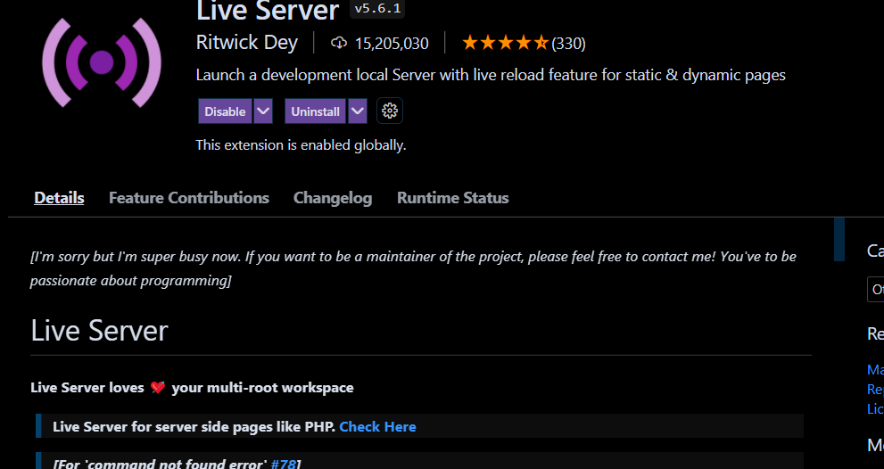

_How to run this project_

1. Download the live server extension by Ritwick Dey from the vs code extension marketplace. Just search for "live server" and it should be the first one that pops up.

2. Reloading vs code might be required, if prompted, please do so.

3. Go to index.html file, right click and choose "open with live server".

4. The server should now be running on port 5500.
